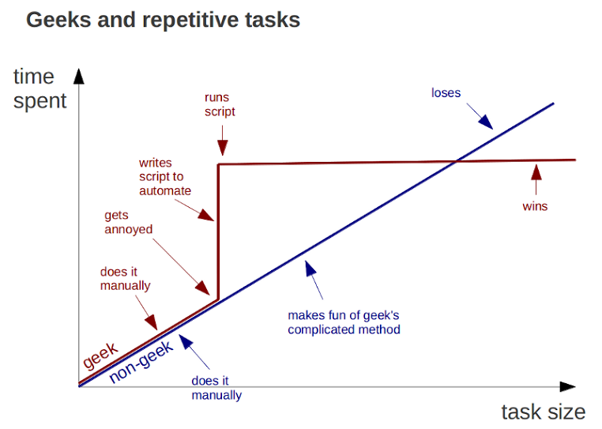
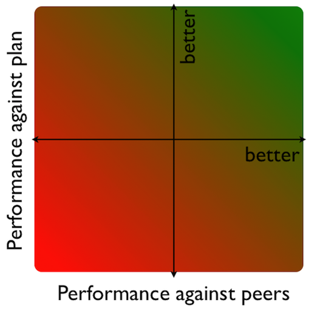

## Abstract

Data is often used to initiate change. 

Indeed, the statistical analysis of data can help to test ideas and hypothesis and provide support for change. 

Yet, it is the interaction with people which matters the most.

Communicating the results of a data analysis and helping others to see the stories in the numbers is challenging. 

I will talk about my experience and the tools I developed to build engaging relationships with my colleagues.

--- .segue .dark 

## This talk will change your life

*** pnotes

This talk is very much about change.
I suppose any talk would like to initiate change.
We, as presenters, think that we have something to tell, 
which will change your life. Forever.
So, basically you will sit through a whole day of marketing.

Yet, change is challenging.
We are human beings, and we only change if we have to.
You want to loose some weight? Eat less and exercise more. Easy.
It's hard isn't it.

--- .segue .dark

## Trust me

*** pnotes

Well, but if my doctor, who I trust, would tell me that 
I need to change or otherwise I would develop a life threatening
disease, then I actually might listen.
I listen to my doctor, because I know him for many years
and he has helped me in the past.
Why would you listen to me and take any advice?
I am up here, so maybe that gives me some authoritative.

--- .segue .quote .dark

<style>
.dark q {
  color: white;
}
</style>

<q> Truth is what connects us.</q>

Karl Jaspers

---

## You can only be proven wrong

<table>
<td>
<br/> 
Karl Popper. Source: <a href="http://archives.lse.ac.uk/record.aspx?src=CalmView.Catalog&id=IMAGELIBRARY%2f5">LSE Image library</a>
</td>
<td>
<br/> 
Black Swan. Source: <a href="http://en.wikipedia.org/wiki/File:Cygnus_atratus_Running.jpg">JJ Harrision</a>, <a href="http://creativecommons.org/licenses/by-sa/3.0/deed.en"/>CC-BY-SA</a>
</td>

</table>

---

## Or, you make money until you don't


---

## Hans Rosling: The World has changed

```{r worldbank, results='asis', echo=FALSE}
# suppressPackageStartupMessages(library(googleVis))
# library(WDI)
# inds <- c('SP.DYN.TFRT.IN','SP.DYN.LE00.IN', 'SP.POP.TOTL',
#           'SE.ADT.1524.LT.FE.ZS')
# indnams <- c("fertility.rate", "life.expectancy", "population",
#              "GDP.per.capita.Current.USD", "15.to.25.yr.female.literacy")
# wdiData <- WDI(country="all", indicator=inds,
#                start=1960, end=format(Sys.Date(), "%Y"), extra=TRUE)
# colnum <- match(inds, names(wdiData))
# 
# names(wdiData)[colnum] <- indnams
# ## Create a motion chart
# WorldBank <- droplevels(subset(wdiData, !region %in% "Aggregates"))
load("WorldBank.RData")
M <- gvisMotionChart(WorldBank,idvar="country", timevar="year",
                      xvar="life.expectancy", yvar="fertility.rate",
                      colorvar="region", sizevar="population",
                      options=list(width=700, height=450,
                                   chartid="WorldBank"))
print(M, file="WorldBank.html")
```

<iframe width="420" height="315" src="http://www.youtube.com/embed/hVimVzgtD6w" frameborder="0" allowfullscreen></iframe>

*** pnotes
I work in the insurance industry
Insurance is not boring either
Insurance allows us to take risks
Insurance enables change

---

## It's easy to replicate Hans' charts

<iframe src="WorldBank.html" frameborder="0">Loading</iframe>

--- .segue .dark

## Change requires a challenge to the accepted truth

---

## The 'turth' varies by background 

  * Underwriting
  * Actuarial
  * Claims 
  * Exposure management
  * Accounting
  * Communication / Marketing
  * Legal
  * IT
  * Regulators
  * Rating agencies

--- .segue .dark

## Find the best comparison

---

## Time well spend?

  
Author: [Bruno Oliveira](https://plus.google.com/102451193315916178828/posts/MGxauXypb1Y)

---

## Performance against plan and peer group



---

## Use interactive charts for what if analysis

<iframe src="http://glimmer.rstudio.com/mages/WhaleChart/" frameborder="0">
Loading</iframe>
Example with [R](http://www.r-project.org) and [googleVis](http://code.google.com/p/google-motion-charts-with-r/) on [shiny](http://www.rstudio.com/shiny/) (Reload this page if no line chart appears)

---

## Be playful and have fun
<iframe src="NetworkD3.html" width="800" height="400" frameborder="0">Loading</iframe>
Example by [Chirstopher Gandrud](http://christophergandrud.blogspot.co.uk/2013/06/quick-and-simple-d3-network-graphs-from.html)


--- .segue .dark

## So what?

--- .segue .quote .dark

<style>
.dark q {
  color: white;
}
</style>

<q>In communication lies the origin of truth.</q>

Karl Jaspers

***pnotes
- Build trustful relationships
- Understand your colleagues / clients' assumptions
- Challenge their current truth to generate actions

---

## Thanks to

* [Steve Brooks](http://www.select-statistics.co.uk/about-us) for inviting me to Exeter
* [Ramnath Vaidyanathan](https://github.com/ramnathv) for [slidify](https://github.com/ramnathv/slidify)
* [Hans Rosling](http://www.gapminder.org) for showing us that data is not boring
* [RStudio](http://rstudio.com) for shiny and hosting my scenario analysis app
* Google for making the [interactive chart tools](https://developers.google.com/chart/) available 
* [R Core](http://www.r-project.org) for their hard work and support

---

## Questions?

* Markus Gesmann
* [markus.gesmann gmail.com](mailto:markus.gesmann@gmail.com)
* My blog: [http://lamages.blogspot.com](http://lamages.blogspot.com)

---

## How I created these slides in R

```{r slidify, eval=FALSE}
library(slidify)
author("InteractiveRelationships")
## Edit the file index.Rmd file and then
slidify("index.Rmd")
```

---

## Session Info
```{r sessionInfo}
sessionInfo()
```
